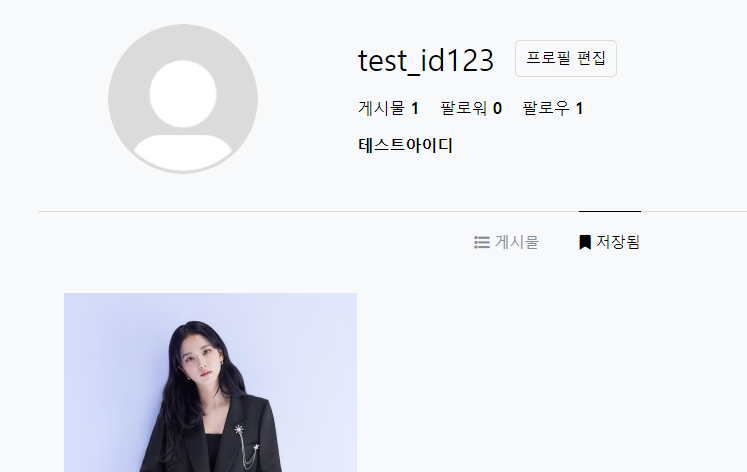

# Anstagram

## 사이트 주소

<https://anstagram.herokuapp.com>

- 처음 접속시 약 30초의 시간이 소요될 수 있습니다.

### 사용방법

1. 화면에 있는 아이디와 비밀번호로 로그인 시 회원가입 없이 사용할 수 있습니다.

   

2. 내가 작성한 게시물의 경우 게시물 삭제 및 수정이 가능합니다.

   

3. 타임라인에서 오른쪽 상단의 + 아이콘 클릭시 게시물을 작성할 수 있습니다.

   
   

4. 댓글이 3개 이상인 게시물의 경우 댓글 더보기를 클릭하면 게시물 상세페이지로 이동합니다.
5. 하트 클릭 또는 이미지 더블클릭시 게시물 좋아요, 오른쪽 저장버튼 클릭시 게시물이 저장됩니다. (내 프로필에 저장된 게시물에서 확인 가능)

   

6. 상대방이 나를 팔로우했을 경우 맞팔로우하기 버튼이 뜹니다.
7. 프로필 상세페이지에서 팔로우/팔로워 조회가 가능합니다.

   

8. 내 프로필 상세페이지에 방문했을 경우 프로필 수정페이지로 이동이 가능합니다.

   

9. 해당 페이지에서 회원의 프로필사진, 닉네임, 이름, 설명 등을 수정할 수 있습니다.

   

### 문서 구조

```sh
├─Server
│  │  README.md
│  │  package.json
│  │  app.js (node)
│  │
│  ├─models
│  │     comment.js
│  │     follow.js
│  │     liked.js
│  │     media.js
│  │     saved.js
│  │     user.js
│  │
│  ├─graphql
│  │     ├─resolvers
│  │     │    auth.js
│  │     │    comments.js
│  │     │    follow.js
│  │     │    index.js
│  │     │    likes.js
│  │     │    medias.js
│  │     │    merge.js
│  │     │    profile.js
│  │     │    save.js
│  │     │
│  │     └─schema
│  │          index.js
│  │
│  └─middleware
│         is-auth.js
│
│
└─frontend
  ├─public
  │    index.html
  │
  └─src
    │ App.js
    │ index.js
    ├───components
    │     ├─Backdrop
    │     │     Backdrop.js
    │     │
    │     ├─Modal
    │     │     FollowModal.js
    │     │     LikeModal.js
    │     │     Modal.js
    │     │
    │     ├─Navigation
    │     │     MainNavigation.js
    │     │
    │     ├─PostDetail
    │     │     PostDetailView.js
    │     │
    │     ├─ProfileDetail
    │     │     ├─PostList
    │     │     │   │   PostList.js
    │     │     │   └─PostItem
    │     │     │       PostItem.js
    │     │     └─SavedList
    │     │         │   SavedList.js
    │     │         └─PostItem
    │     │             SavedItem.js
    │     │
    │     ├─Spinner
    │     │     Spinner.js
    │     │
    │     │
    │     └─Timeline
    │           │ TimelineRight
    │           └─TimelineList
    │               │   TimelineList.js
    │               └─TimelineItem
    │                   TimelineItem.js
    │
    ├─context
    │    auth-context.js
    │
    └─pages
        Auth.js
        EditAccount.js
        PostDetail.js
        ProfileDetail.js
        Timeline.js

```

### 참고사항

- 내 팔로우 한 상대의 게시물만 타임라인에 표시됩니다.

- 팔로잉/언팔로우시 리스트 업데이트에는 약간의 시간이 소요될 수 있습니다. (DB와의 통신 문제)

- 프로필 편집시 업데이트에는 약간의 시간이 소요될 수 있습니다. (DB와의 통신 문제)

## Front-end

- React.js

## Back-end

- Node.js
- GraphQl
- MongoDB
